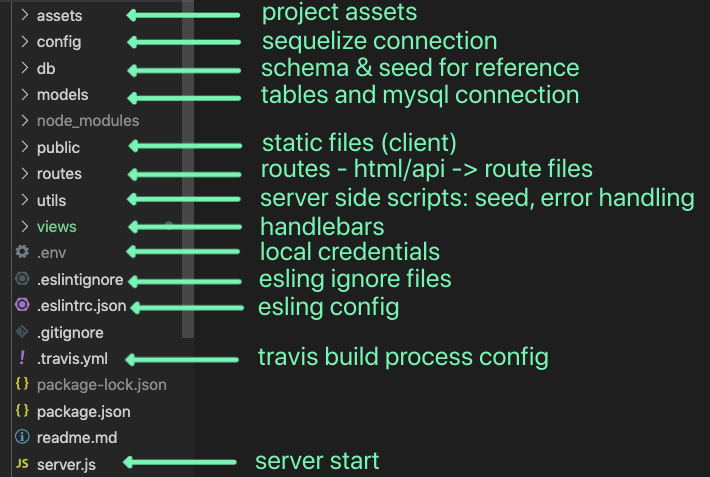
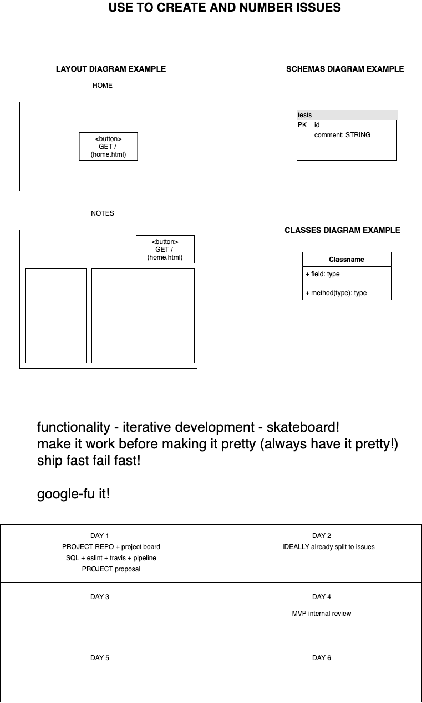

 
# 📦 Express Sequelize box

## To-Do: Readme!

## Use
- Fork or clone and copy what you need

## env vars
- for production set on heroku: https://dashboard.heroku.com/apps/<app-name>/settings -> reveal env vars
- locally: creat a `.env` file with key and value pair in form/url encoding `SECRET_KEY=val`
- connection code on models/index.js: 

## Folder structure

## CI
- travis: travis.io
- code coverage: codacy.com
- monitor on: https://ronerlih.loggly.com/search?terms=tag:heroku&from=-20m&until=now&source_group=&newtab=1#terms=&from=2020-11-07T12:03:00.296Z&until=2020-11-07T13:03:00.296Z&source_group=

## diagram expmles: 

## To-Do:
- write tests (Jest / mocha+chai)
   - send test reports to code covarage 

- log (winston/ bunyan/ log4js/ morgan)
   - dashborad monitor + notifications

## Further
- express best practices: https://expressjs.com/en/advanced/best-practice-performance.html